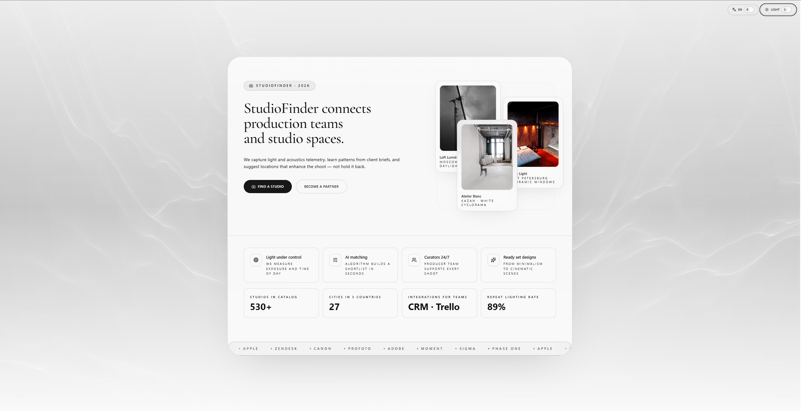
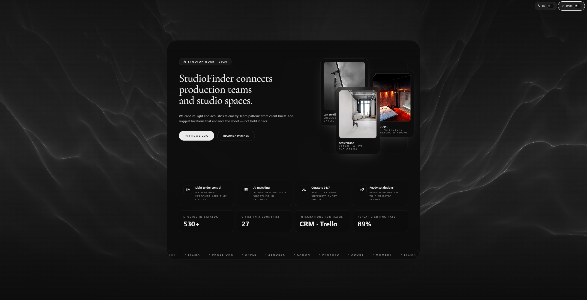

# StudioFinder Landing UI

[](LICENSE)
[](https://react.dev/)
[](https://www.typescriptlang.org/)
[](https://vitejs.dev/)

Open-source landing page design for photo studio aggregators. Free to use, fork, and adapt for your own projects.

**Русская документация:** [README.ru.md](README.ru.md)

## Preview

| Light theme | Dark theme |
| --- | --- |
|  |  |

## Features

- Animated hero with WebGL shader background (Three.js / React Three Fiber)
- Light and dark themes with smooth transitions
- English and Russian UI (i18n)
- Scroll reveal animations (Framer Motion)
- Responsive layout for desktop and mobile
- Monochrome design system built with Tailwind CSS
- Editorial display typography (Cormorant Garamond)
- Built-in 80% UI scale (matches browser zoom, without breaking the shader hero)

## Quick start

**Requirements:** Node.js 18+, npm 9+

```bash
git clone https://github.com/NAGenaev/sf-front.git
cd sf-front
npm install
npm run dev
```

Dev server: http://127.0.0.1:5173/

## Scripts

| Command | Description |
| --- | --- |
| `npm run dev` | Start development server |
| `npm run build` | Type-check and build for production |
| `npm run preview` | Preview production build locally |

Production output is written to `dist/`.

## Project structure

```
sf-front/
├── docs/                 # Screenshots and documentation assets
├── public/               # Static files (favicon)
├── src/
│   ├── i18n/             # Translations (EN / RU) and language provider
│   ├── lib/              # Shared utilities
│   ├── pic/              # Demo studio photos (webp)
│   ├── newdis.tsx        # Main landing page component
│   ├── App.tsx
│   └── index.css         # Theme tokens, UI scale, global styles
├── LICENSE
└── README.md
```

## Customization

| What | Where |
| --- | --- |
| Copy and branding | `src/i18n/translations.ts` |
| Colors and theme | CSS variables in `src/index.css` (`:root` / `.dark`) |
| UI scale (default 80%) | `--ui-scale` in `src/index.css` |
| Hero and sections | `src/newdis.tsx` |
| Demo images | Replace files in `src/pic/` |

The hero shader uses a separate scale-cancel layer so WebGL backgrounds stay full-screen while the rest of the page is scaled.

## Tech stack

- React 18, TypeScript, Vite 7
- Tailwind CSS, tailwind-merge, clsx
- Framer Motion, Lucide React
- Three.js, React Three Fiber

## License

MIT © 2026 [GENAEV NIKITA ANDREEVICH (NAGenaev)](https://github.com/NAGenaev)

Use freely in personal and commercial projects. Attribution is appreciated but not required.

See [LICENSE](LICENSE) for the full text.

## Contributing

Contributions are welcome — bug reports, translations, and UI improvements.

See [CONTRIBUTING.md](CONTRIBUTING.md) for guidelines.
